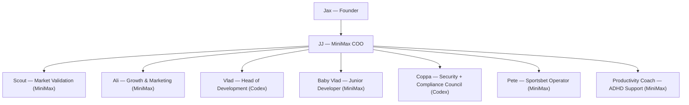

# Elevate Flow — Mission Control

## Operating Source of Truth
This document is the operating source of truth for mission targets, active agent roster, and phase priorities.

## Scope Hierarchy
- This file governs mission target, active roster, phase priorities, and execution flow.
- `docs/canon/*` governs framework contracts, security rules, and non-negotiable operating constraints.
- If wording conflicts, canon non-negotiables win and JJ updates this file to restore consistency.
- Hard execution constraint: Elevate Flow agents do not have local drive access on Jax machines; use Git/API only.

## Mission
Reach **$3,000 USD/month** net profit by **June 2026** through focused validation, rapid product delivery, and disciplined growth loops.

**North Stars**
- Monthly net profit run-rate ≥ $3K
- Mission Control MVP live with only Pete, Ali, and Coach endpoints
- JJ token efficiency stabilized by reducing Telegram/OpenClaw thread bloat

---
## Org Chart (Mermaid)

---
## OKRs — Q1/Q2 2026
**Objective:** Stand up a repeatable $3K/month net profit engine by June.
- **KR1:** Ship Mission Control MVP with only Pete, Ali, and Coach endpoints.
- **KR2:** Reduce JJ operational token waste from Telegram/OpenClaw thread bloat to an efficient baseline.
- **KR3:** Define and lock mission flow with clear owner handoffs and escalation rules.
- **KR4:** Maintain framework reliability baseline (`clerk-service` healthy, registry/snapshot validation green).

---
## Agent Playbooks
| Agent | Model | Charter | KPI Focus | Immediate Next Action |
|-------|-------|---------|-----------|------------------------|
| **Scout** | MiniMax | Identify high-LTV problems & money flows; benchmark competitors/pricing. | 2 validated opportunities/week | Compile top 5 “$3K/month” plays by Mon. 24 Feb. |
| **Ali** | MiniMax | Growth loops, channels, offer messaging. | 50 qualified leads/week | Outline 3-channel test plan (email, communities, partnerships). |
| **Vlad** | Codex | Core dev + automation builds. | Sprint velocity \> 90% | Estimate engineering effort for MVP spec. |
| **Baby Vlad** | MiniMax | Execute scoped junior dev tasks under Vlad direction. | Time-to-ship on small fixes | Implement small endpoint/test/doc tasks and escalate unknowns in 2 hours. |
| **Coppa** | Codex | Security and compliance governance, risk mitigation, and veto authority. | Zero unresolved security/compliance incidents | Review permissions, secrets handling, and compliance blockers before rollout. |
| **Pete** | MiniMax | Sportsbet signals to boost Jax’s extra cash goals. | Weekly ROI report | Summarize current leagues + best edges. |
| **Coach** | MiniMax | ADHD-aware accountability for Jax. | Weekly check-ins delivered | Draft weekly ritual (review/plan/celebrate). |
| **JJ (COO)** | MiniMax | Day-to-day coordination, task tracking, status updates. | Mission dashboard accuracy | Stand up daily checklists + reminders. |

---
## Roadmap
### Phase 1 — Mission Control MVP + Ops Efficiency (Now)
1. Build Mission Control MVP with only Pete, Ali, and Coach endpoints.
2. Ensure JJ operates at efficient capacity by fixing Telegram/OpenClaw dashboard thread bloat and token waste.
3. Define OKRs and mission flow clearly (owners, inputs, outputs, escalation).

### Phase 2 — TBC
- Scope to be defined after Phase 1 outcomes and efficiency metrics are reviewed.

---
## Command Deck (JJ’s Daily Checklist)
1. **Status Sync:** Snapshot each agent’s state + blockers.
2. **Task Review:** Update `memory/YYYY-MM-DD.md` with new commitments.
3. **Reminders:** Trigger follow-ups (MiniMax) for upcoming deadlines.
4. **Escalations:** Flag decisions Jax needs to weigh in on.
5. **Reporting:** Publish daily Mission Control digest (mini paragraph).

---
## Parking Lot
- Mission transcript ingestion (pending Telegram export)
- Detailed OKR metrics (attach dashboards once ready)
- Tooling for automated agent hand-offs (Mermaid swimlanes or flowchart)

_Add/edit sections as we flesh out deliverables and progress._
