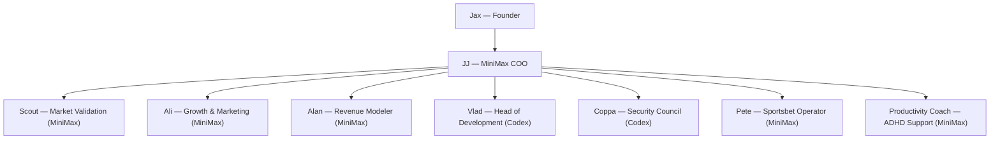

# Zero Mission SOT (Source Of Truth)

## Mission
Reach **$3,000 USD/week** in revenue by **June 2026** through focused validation, rapid product delivery, and disciplined growth loops.

**North Stars**
- Weekly revenue run-rate ≥ $3K
- 2 validated offers with paying users
- 4-week rolling retention ≥ 50% for flagship offer

---
## Org Chart (Mermaid)

---
## Active OKRs - 48 Hours (March 3-4, 2026 AEST)
**Objective:** Rebuild Mission Control MVP and launch web version with Pete-first workflow.
- **KR1:** Deploy rebuilt Mission Control with only two modules:
  - Pete's Page (landing module)
  - Agents Docs page (all agent docs accessible to Jax)
- **KR2:** Pete's Page publishes by **9:00 AM AEST** with:
  - Bet of the Day
  - Parlay of the Day
  - Logic summary for choice and parlay
- **KR3:** DFS is excluded from MVP UI scope.
- **KR4:** Pete's Page includes goal tracker for JJ/Jax updates:
  - pick, odds, result, PnL, notes
- **KR5:** Current Mission Control implementation is fully rebuildable; no legacy UI constraints.

## Pete Betting Scoreboard (Weekly Success/Fail)
- Starting funding (USD)
- Total staked (USD)
- Wins
- Losses
- Pushes
- Gross return (USD)
- Net PnL (USD)
- Weekly ROI (%)
- Hit rate (%)
- Best Bet PnL (USD)
- Parlay PnL (USD)
- Owner: JJ updates daily from Jax bet/result entries

---
## Agent Playbooks
| Agent | Model | Charter | KPI Focus | Immediate Next Action |
|-------|-------|---------|-----------|------------------------|
| **Scout** | MiniMax | Identify high-LTV problems & money flows; benchmark competitors/pricing. | 2 validated opportunities/week | Compile top 5 “$3K/week” plays by Mon. 24 Feb. |
| **Ali** | MiniMax | Growth loops, channels, offer messaging. | 50 qualified leads/week | Outline 3-channel test plan (email, communities, partnerships). |
| **Alan** | MiniMax | Pricing, unit economics, cash runway. | Weekly revenue dashboard | Build simple revenue worksheet + breakeven chart. |
| **Vlad** | Codex | Core dev + automation builds. | Sprint velocity \> 90% | Estimate engineering effort for MVP spec. |
| **Coppa** | Codex | Tool safety, secrets, governance. | Zero unresolved safety incidents | Review current tool perms + plan audits (later). |
| **Pete** | MiniMax | Sportsbet signals to boost Jax’s extra cash goals. | Weekly ROI report | Summarize current leagues + best edges. |
| **Coach** | MiniMax | ADHD-aware accountability for Jax. | Weekly check-ins delivered | Draft weekly ritual (review/plan/celebrate). |
| **JJ (COO)** | MiniMax | Day-to-day coordination, task tracking, status updates. | Mission dashboard accuracy | Stand up daily checklists + reminders. |

---
## Roadmap
### Phase 1 — Alignment (Week 1)
- Lock mission control + org chart ✅
- Capture mission + OKRs ✅ (refine as needed)
- Gather all mission transcript assets ➜ *pending*
- Run MiniMax COO trial + daily ops scripting ➜ *in progress*

### Phase 2 — Market Validation (Weeks 1–2)
- Scout delivers Top-5 opportunities list
- Alan drafts monetization worksheets
- Ali outlines acquisition experiments
- Vlad maps MVP specs aligned to top opportunity

### Phase 3 — Build & Launch (Weeks 3–5)
- Vlad leads MVP build
- Coppa ensures safe tooling
- Ali + Scout prep beta list
- Alan sets up billing + KPI instrumentation

### Phase 4 — Scale & Optimize (Weeks 6+)
- Ali/Growth accelerate best channel
- Alan tunes pricing packages
- Coppa ensures compliance for scale
- Pete + Coach support ancillary goals

---
## Command Deck (JJ’s Daily Checklist)
1. **Status Sync:** Snapshot each agent’s state + blockers.
2. **Task Review:** Update `memory/YYYY-MM-DD.md` with new commitments.
3. **Reminders:** Trigger follow-ups (MiniMax) for upcoming deadlines.
4. **Escalations:** Flag decisions Jax needs to weigh in on.
5. **Reporting:** Publish daily Mission Control digest (mini paragraph).

---
## Parking Lot
- Mission transcript ingestion (pending Telegram export)
- Detailed OKR metrics (attach dashboards once ready)
- Tooling for automated agent hand-offs (Mermaid swimlanes or flowchart)

_Add/edit sections as we flesh out deliverables and progress._
